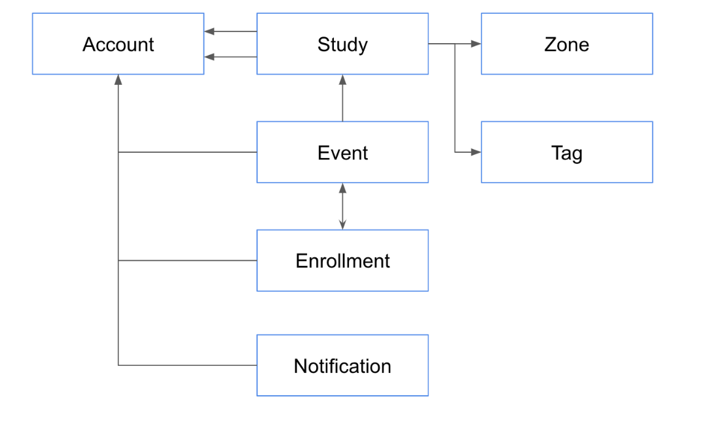

# Spring 과 JPA 기반 웹 애플리케이션 개발 

### [ _개인 서브 프로젝트_ ]

* 기간 : 23.03.03(금) ~ 진행 중
* 목표 : 웹 애플리케이션이 기본으로 갖추고 있는 기능 구현 역량 강화
* 구현 : 개발 스터디 모집 관리 애플리케이션
* 기능 :
  * 회원가입
  * 이메일 인증 처리
  * 로그인/로그아웃
  * 도메인 데이터 CRUD
  * 검색, 알림, 모임 관리, 스터디 관리 기능
  * 관심 주제(태그), 지역 설정 기능
  * 페이징 및 정렬
  * 프로파일

> 1) 실무에서 사용되는 기술 구현 역량 강화
> 2) 리팩토링, 테스트 코드 작성 기술 습득
> 3) JPA 에 대해 깊이있게 학습

---

## 기술 스택
### LANGUAGE
* Java 11

### IDE
* IntelliJ (Ultimate)

### BUILD
* Maven

### SERVER
* Spring boot
* Spring Web MVC
* Thymeleaf (view template)
* Thymeleaf-extras (타임리프 스프링 시큐리티5 확장)
* Spring Security
* Spring Data JPA
* H2
* MySQL
* Lombok
* Spring mail
* Query DSL
* Devtools
* ModelMapper
* Gmail SMTP (메일 전송) 
* ArchUnit (아키텍처 테스트 유틸리티)
* [TODO] PostgreSQL
* [TODO] TestContainer, TestContainer-PostgreSQL 모듈 (docker container)

### FRONTEND
> 프론트 라이브러리는 git에 올려 관리하지 않기 때문에 maven build할 때 자동으로 설치하도록 설정
* Bootstrap
* jquery, AJAX
* font-awesome
* Cropper.js (아바타 이미지 잘라서 저장)
* [Tagify (태그,@yeireo)](https://github.com/yairEO/tagify)
* 위지윅 에디터 (summernote)
* moment (date format)
* Bootbox.js(모달창)
* mark.js
* NPM
* package.json

---

## 도메인 관계도

## 검증 방식
* 1차로 view 에서 검증 (빠른 사전 차단을 위해)
* 2차 sever controller 검증 (악의적인 접근 방지)
  * JSR 303 어노테이션 검증
  * @InitBinder 와 Validator 인터페이스를 통해 커스텀 검증
  
 

## 알림 처리 설계
> 응답시간, 트랜잭션, 메인 로직에 영향 X
* 비동기 이벤트 기반으로 알림 처리
* ApplicationEventPublisher
* 스프링 @Async

---

## REFERENCE
* [인프런] 스프링과 JPA 기반 웹 애플리케이션 개발 - 백기선